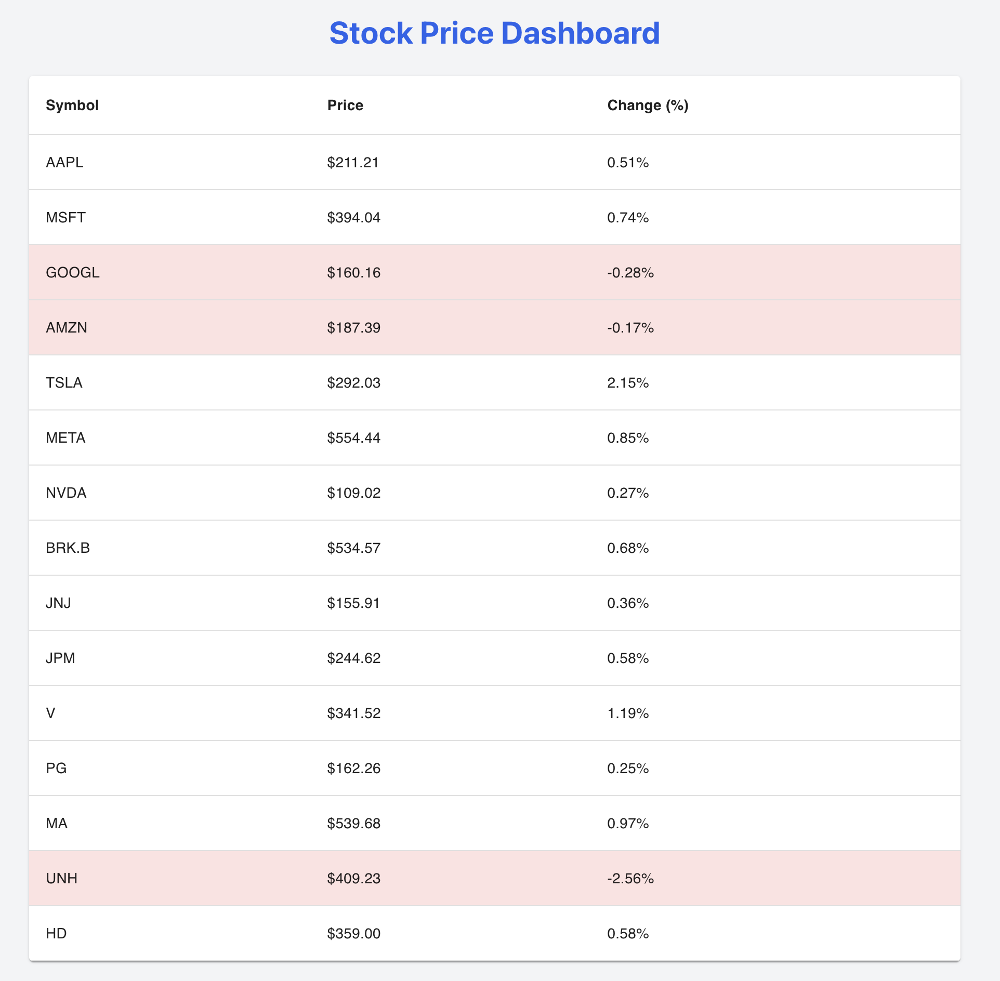
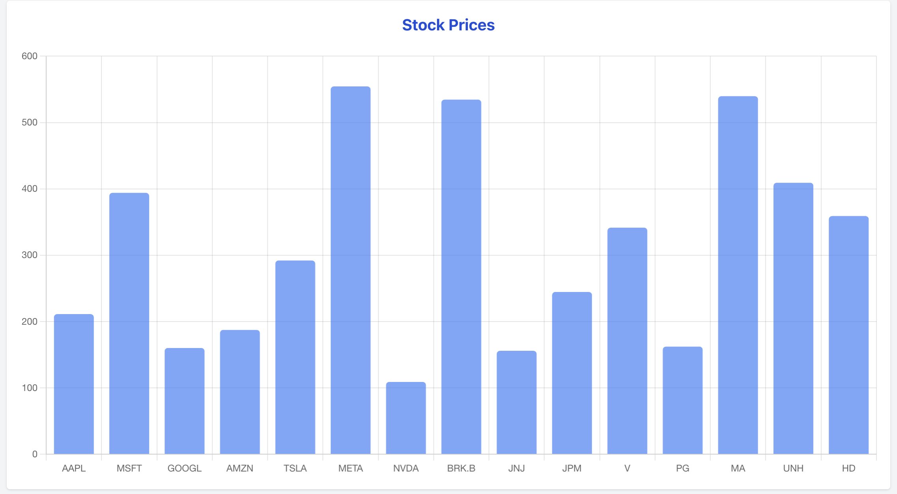
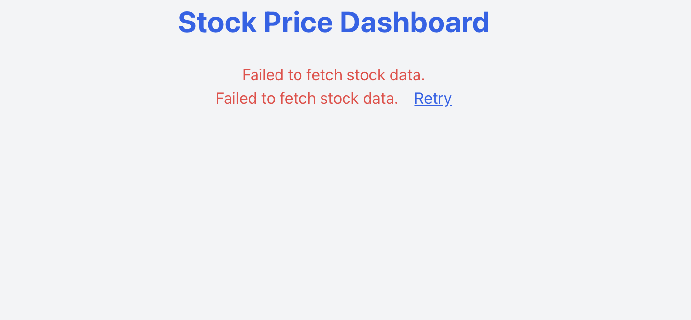

# Stock Price Dashboard

A responsive stock price dashboard built with **React**, **TypeScript**, **Tailwind CSS**, and **Material UI**, visualizing live data from the **Finnhub API**. It displays stock price information in a table and an optional bar chart view.

This project was developed as part of a frontend challenge for an internship application.

---

## Features

### Functionality
- Fetches live stock data (Symbol, Price, Change %)
- Displays data in a styled **Material UI table**
- Responsive layout using **Tailwind CSS**
- Uses **Finnhub.io API** for real-time data

### Bonus Features
-  **Bar chart** visualization using `Chart.js` (`react-chartjs-2`)
- Dynamic styling (red rows for negative % changes)
- Table centered and styled with max-width
-  Styled column headers using MUI's `sx` prop
-  Handles API rate limits with throttled requests

---

## Screenshots

### Table View (Table)



### Bar Chart View



### Error Message View



---

##  Tech Stack

- **React** + **TypeScript**
- **Tailwind CSS**
- **Material UI**
- **Chart.js (via react-chartjs-2)**
- **Axios** (for API requests)
- **Finnhub API** (for stock quotes)

---

## Setup Instructions

```bash
# Start the development server
npm start
